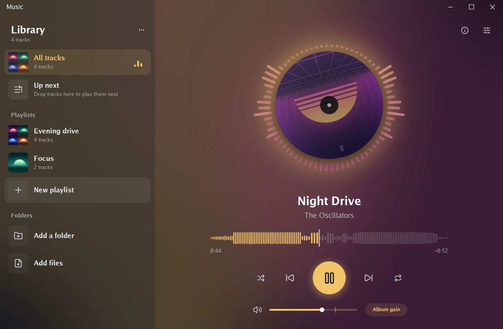

# Skiva

Skiva is a music player. The track playing is a picture disc that spins
while it plays and runs down slowly as it pauses, ringed by bars that
move with the music, pitch by pitch. Lights in the cover's colours drift
behind everything and swell with the bass, and a new track's colours
flow through the whole window. The seek bar is the track itself, drawn
as its loudness along it.

Skiva is Swedish for a record. It is made by [Skalarit AB](https://skalarit.se)
with [gunim](https://github.com/marrasen/gunim), a GUI framework in Go,
and runs on Linux, Windows and Android.



## Install it

Download the newest release for Windows or Linux from
[Releases](https://github.com/skalarit-ab/skiva/releases) and run it.
It installs Skiva for you alone, with no administrator, and offers to
open MP3, FLAC, Ogg Vorbis and WAV files with it. The installed Skiva
keeps itself up to date: Settings, in the library's menu, say whether
updates come by themselves, after asking, or not at all, and whether
betas come too. Every update is signed, and Skiva runs no other.

A file opened with Skiva plays at once. Opened while Skiva runs, it goes
to the Skiva running, and several opened together play one after
another.

## Run it

```sh
go run github.com/skalarit-ab/skiva@latest
go run github.com/skalarit-ab/skiva@latest -dir ~/Music
go run github.com/skalarit-ab/skiva@latest song.flac
```

It always has four songs made in code, so it plays anywhere. Its library
follows folders of MP3, FLAC, Ogg Vorbis and WAV files, with their tags
and covers: tracks copied in join it within seconds, and tracks deleted
leave. It follows your music folder from the first run, and `-dir` or
the library's Add a folder adds more. Playlists gather tracks by hand,
and their rows move by their grips. The library and the playlists are
kept between runs. A file added to the library on its own leaves it by
its row's menu; a folder's tracks leave with the folder. Up next holds
the tracks to play before the list goes on. Tracks drag from their rows,
and files drag in from a file manager, and each drops where it is let
go: on the track playing, to play now, with the rest first on Up next;
on a playlist or Up next, to join it at the gap shown; or on the
library, which follows a folder dropped there. A drag resting on a
list's back button slides it away, to drop on the shelf. The equalizer,
E, is parametric: up to eight bands, each a bell, a shelf, a cut or a
notch, dragged about a graph, with the sound's spectrum before and after
it drawn behind them.

Loudness gain plays each track, or each album played in order, at -18
LUFS, measured in the background and kept between runs. Its button
steps between no gain, track gain and album gain, and two tracks
crossfading each keep their own. The volume bar shows the gain as the
pointer comes over it, and I opens a card of the track's file, quality
and loudness. Space plays and pauses, the arrows seek and set the
volume, N and P skip, S shuffles and R repeats.

The system's media controls show the track playing, with its cover, and
play, pause, skip and seek it. The window's title names the track, so
Alt+Tab and the taskbar show it. The window opens where it last closed,
on a monitor still attached, and fades out with the music as it closes.

## On Android

gunim's `gunimapk` builds the APK, and `-run` installs it on the phone
or emulator `adb` sees and starts it. Skiva draws its own launcher icon.
`music` lets it read the phone's music, and `playback` lets it play on
in the background, with the system's media controls:

```sh
go run . -write-icon /tmp/skiva-icon.png
go run github.com/marrasen/gunim/tools/gunimapk -id se.skalarit.skiva -name Skiva \
	-icon /tmp/skiva-icon.png -permissions music,playback -run .
```

For Google Play, an `-o` ending in `.aab` writes an App Bundle, signed
with Skalarit's upload key:

```sh
go run github.com/marrasen/gunim/tools/gunimapk -keystore ~/keys/skalarit-upload.jks -key upload \
	-id se.skalarit.skiva -name Skiva -icon /tmp/skiva-icon.png -permissions music,playback \
	-version 0.1.0 -o /tmp/skiva.aab .
```

## Releases

A tag, as `v0.3.0` or the beta `v0.3.0-beta.1`, publishes a release;
see [RELEASING.md](RELEASING.md). Desktop and Android share version
numbers.

## History

Skiva started as gunim's `example/music` and moved here, with its
history, on 2026-10-08. It keeps its library in a folder named `skiva`
in the user's settings, and moves the one the example kept, named
`gunim-music`, there the first time it runs.

## Licence

Apache License 2.0; see [LICENSE](LICENSE) and [NOTICE](NOTICE).
